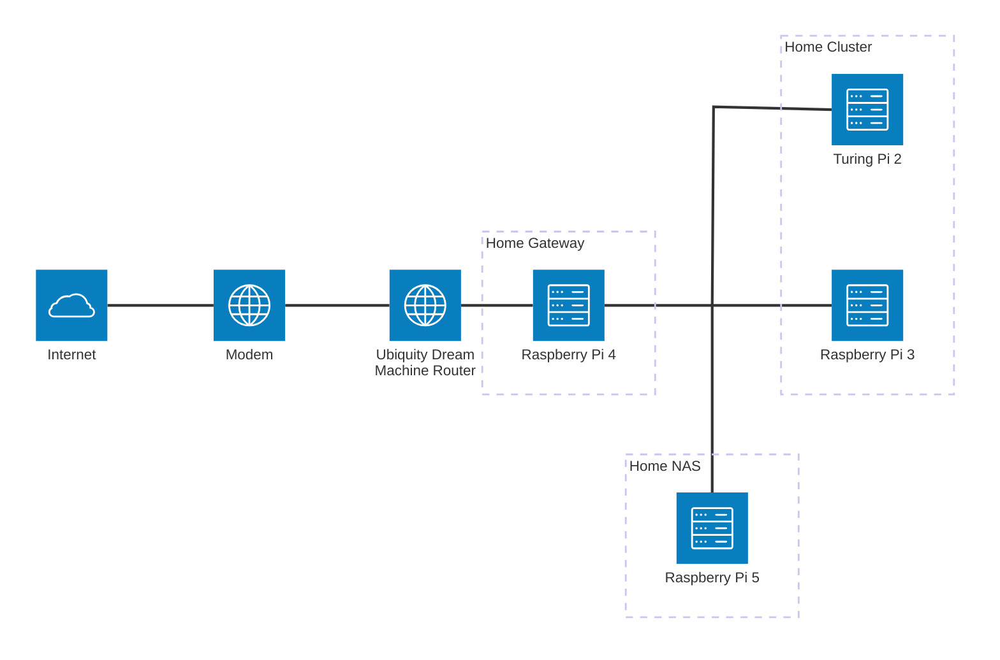

# 🧪 Nicolas's Home Lab
This repository contains all the resources I use to maintain my home lab. 
I use my home lab mainly to run Home Assistant, but also to experiment and ultimately to learn about IaC, GitOps, Linux, Docker, Kubernetes, etc...

The repository is mainly composed of Ansible resources.

## Purpose
The purpose of this repository is simply to share how I manage my home lab. If it helps anyone to achieve similar goal, then the objective is reached! 👍

Your comments and suggestions are welcome!

## Architecture
My home lab is composed of 3 _logical_ components:
1. The "Home Gateway": to manage "critical" services like DNS, reverse proxy and certificates renewal.
2. The "Home Cluster": to manage all other services like Home Assistant.
3. The "Home NAS": to have a local network storage.



Therefore, there are 3 Ansible roles to manage them.

## Repository layout
```
├─📝 inventory.yml        # Ansible inventory file
├─📝 home-gateway.yml     # Playbook for the home gateway
├─📝 home-cluster.yml     # Playbook for the home cluster
├─📝 home-nas.yml         # Playbook for the home NAS
├─📝 renovate.json        # Renovate configuration file
└─📁 roles                # Ansible roles
  ├─📁 home_gateway       # Role for the home gateway
  ├─📁 home_cluster       # Role for the home cluster
  ├─📁 home_nas           # Role for the home NAS
  ├─📁 configure_ssh      # Role to configure SSH on control and managed nodes
  ├─📁 rpi_cgroupmemory   # Role to enable cgroup settings
  └─📁 rpi_upgrade        # Role to update and upgrade packages
```

## Home Gateway
### Hardware
Raspberry Pi 4 Model B Rev 1.2 with:
  - [Raspberry PoE+ HAT](https://www.raspberrypi.com/products/poe-plus-hat/)
  - GeeekPi Aluminum Case for Raspberry Pi 4 with Fan

### Software
- [AdGuard](https://adguard.com/) for DNS
- [HAProxy](https://www.haproxy.org/) for reverse proxy
- [Certbot](https://certbot.eff.org/) for certificates renewal
- [Prometheus](https://prometheus.io/) for monitoring
- [Node Exporter](https://github.com/prometheus/node_exporter) for monitoring
- [cAdvisor](https://github.com/google/cadvisor) for monitoring
- [Portainer Agent](https://github.com/portainer/agent) for monitoring

## Home Cluster
### Hardware
  - [Turing Pi 2.4](https://turingpi.com/) board with:
    - 4 Raspberry Pi Compute Module 4, 8 GB RAM, 32 GB eMMC
    - 4 IBest Aluminum Heatsink
    - [SilverStone Milo 10 mini ITX Case](https://www.silverstonetek.com/en/product/info/computer-chassis/Milo10/)
    - Western Digital-WD SN530 M.2 2230 SSD 256 Go NVMe PCIe Gen3 x4
    - Mini PCIE to NVME Adapter

  - Raspberry Pi 3 Model B Plus Rev 1.3 with:
    - [Raspberry Pi 3 Case](https://www.raspberrypi.com/products/raspberry-pi-3-case/)
    - [Anker PowerConf S330](https://us.ankerwork.com/products/a3308) Speakerphone

### Software
- [K3s](https://k3s.io/) for Kubernetes containers orchestration
- [Helm](https://helm.sh/) for Kubernetes package management, with [Helm diff Plugin](https://github.com/databus23/helm-diff)
- [Argo CD](https://argo-cd.readthedocs.io/en/stable/) for continuous delivery
- [NFS Subdir External Provisioner](https://github.com/kubernetes-sigs/nfs-subdir-external-provisioner) for NFS
- [Duplicati](https://duplicati.com/) for backups
- [Home Assistant](https://www.home-assistant.io/) for home automation
- [Wyoming Vosk](https://github.com/rhasspy/wyoming-vosk) for speech to text
- [Wyoming Piper](https://github.com/rhasspy/wyoming-piper) for text to speech
- [Wyoming Porcupine1](https://github.com/rhasspy/wyoming-porcupine1) for wake word detection
- [Wyoming Satellite](https://github.com/rhasspy/wyoming-satellite) for voice assistant
- [Kube Prometheus Stack](https://github.com/prometheus-community/helm-charts/tree/main/charts/kube-prometheus-stack) for monitoring
- [Portainer](https://www.portainer.io/) for monitoring

## Home NAS
### Hardware
Raspberry Pi 5 Model B Rev 1.0 8Gb with:
  - [Waveshare PCIe To M.2 Adapter With PoE Function](https://www.waveshare.com/poe-m.2-hat-plus.htm)
  - GeeekPi Aluminum Case for Raspberry Pi 5 with Fan
  - KingSpec 1To M.2 2242 NVMe M.2 PCIe SSD Gen3 x4

### Software
- [Open Media Vault](https://www.openmediavault.org) for NAS solution
- [Prometheus](https://prometheus.io/) for monitoring
- [Node Exporter](https://github.com/prometheus/node_exporter) for monitoring